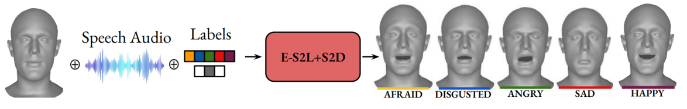
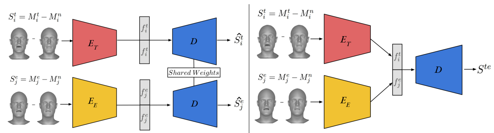

# EmoVOCA (WACV 2025)

### EmoVOCA: Speech-Driven Emotional 3D Talking Heads

[]([https://arxiv.org/abs/2403.12886](https://arxiv.org/abs/2403.12886))
[](https://fedenoce.github.io/emovoca/)
[](https://github.com/miccunifi/emovoca)


This is the **official repository** of the [**WACV 2025 paper**](https://fedenoce.github.io/emovoca/) "*EmoVOCA: Speech-Driven Emotional 3D Talking Heads*" by Federico Nocentini, Claudio Ferrari, Stefano Berretti.

🔥🔥 **[2025/01/25] Our code is now public available! Feel free to explore, use, and contribute!** 


## Overview

The domain of 3D talking head generation has witnessed significant progress in recent years. A notable challenge in this field consists in blending speech-related motions with expression dynamics, which is primarily caused by the lack of comprehensive 3D datasets that combine diversity in spoken sentences with a variety of facial expressions. Whereas literature works attempted to exploit 2D video data and parametric 3D models as a workaround, these still show limitations when jointly modeling the two motions. In this work, we address this problem from a different perspective, and propose an innovative data-driven technique that we used for creating a synthetic dataset, called EmoVOCA, obtained by combining a collection of inexpressive 3D talking heads and a set of 3D expressive sequences. To demonstrate the advantages of this approach, and the quality of the dataset, we then designed and trained an emotional 3D talking head generator that accepts a 3D face, an audio file, an emotion label, and an intensity value as inputs, and learns to animate the audio-synchronized lip movements with expressive traits of the face. Comprehensive experiments, both quantitative and qualitative, using our data and generator evidence superior ability in synthesizing convincing animations, when compared with the best performing methods in the literature.


We introduce **EmoVOCA**, a novel approach for generating a synthetic 3D Emotional Talking Heads dataset which leverages
speech tracks, intensity labels, emotion labels, and actor specifications. The proposed dataset can be used to surpass the lack of 3D datasets
of expressive speech, and train more accurate emotional 3D talking head generators as compared to methods relying on 2D data as proxy.


Overview of our framework. Two distinct encoders process the talking and expressive 3D head
displacements, separately, while a common decoder is trained to reconstruct them. At inference, talking and emotional heads are
combined by concatenating the encoded latent vectors, and the decoder outputs a combination of their displacements.

## Citation
```bibtex
@inproceedings{nocentini2024emovocaspeechdrivenemotional3d,
    title={EmoVOCA: Speech-Driven Emotional 3D Talking Heads}, 
    author={Federico Nocentini and Claudio Ferrari and Stefano Berretti},
    booktitle = {Proceedings of the IEEE/CVF Winter Conference on Applications of Computer Vision (WACV)},
    year = {2025},
  }
```

<details>
<summary><h2>EmoVOCA Installation Guide</h2></summary> 

This guide provides step-by-step instructions on how to set up the ScanTalk environment and install all necessary dependencies. The codebase has been tested on **Ubuntu 20.04.2 LTS** with **Python 3.8**.

## 1. Setting Up Conda Environment

It is recommended to use a Conda environment for this setup.

1. **Create a Conda Environment**
    ```bash
    conda create -n emovoca python=3.8.18
    ```

2. **Activate the Environment**
    ```bash
    conda activate emovoca
    ```

## 2. Install Mesh Processing Libraries

1. **Clone the MPI-IS Repository**
    ```bash
    git clone https://github.com/MPI-IS/mesh.git
    ```

    ```bash
    cd mesh
    ```

2. **Modify line 7 of the Makefile to avoid error**
    ```
    @pip install --no-deps --config-settings="--boost-location=$$BOOST_INCLUDE_DIRS" --verbose --no-cache-dir .
    ```
3. **Run the MakeFile**
    ```bash
    make all
    ```

## 2. Installing PyTorch and Requirements

Ensure you have the correct version of PyTorch and torchvision. If you need a different CUDA version, please refer to the [official PyTorch website](https://pytorch.org/).

1. **Install PyTorch, torchvision, and torchaudio**
    ```bash
    conda install pytorch==2.1.0 torchvision==0.16.0 torchaudio==2.1.0 pytorch-cuda=12.1 -c pytorch -c nvidia
    ```

2. **Install Requirements**
    ```bash
    pip install -r requirements.txt
    ```
---

</details>

<details>
<summary><h2>EmoVOCA</h2></summary> 

For training and testing EmoVOCA DE-SD, we used two open-source datasets for 3D facial data: [**vocaset**](https://voca.is.tue.mpg.de/) and [**Florence 4D Facial Expression Dataset**](https://www.micc.unifi.it/resources/datasets/florence-4d-facial-expression/). Please note that you must obtain authorization to use both datasets.

To generate meshes with EmoVOCA, follow these steps:  
1. Download the [**vocaset dataset**](https://voca.is.tue.mpg.de/) and place it in the `Dataset` folder located in the main directory.  
2. The meshes used for conditioning vocaset have already been added to the `EmoVOCA_generator/New_Conditions` folder. For additional data, download the [**Florence 4D dataset**](https://www.micc.unifi.it/resources/datasets/florence-4d-facial-expression/).  

Pre-generated EmoVOCAv2 sequences are available [**here**](https://drive.google.com/drive/folders/1xcABG8Q3dT_O97QD6iM_IcAO14PKDcDM?usp=sharing). To use them:  
1. Download the folder and place it inside the `Dataset` folder in the main directory.  
2. Extract all the files to ensure proper access.  

</details>

<details>
<summary><h2>Pretrained Models Installation</h2></summary> 

We are releasing three models:  

1. **`emovoca_generator.tar`**: The DE-SD framework used to generate EmoVOCA.  
2. **`es2l.tar`**: The ES2L framework trained on EmoVOCA.  
3. **`es2s.tar`**: Another ES2L framework trained on EmoVOCA.  

All models are available for download [**here**](https://drive.google.com/drive/folders/1Ff1wjxYNXdlxm_CDTbjWPXrAy9H0lusS?usp=sharing). After downloading, place the `saves` folder inside each model's directory to ensure proper setup.

</details>
<details>
<summary><h2>Training, Testing and Demo</h2></summary> 

Inside the model folders `ES2L` and `ES2D`, you will find both the model definitions and the training code for each component.  

In the `EmoVOCA_generator` folder, you will find the code required to generate any version of EmoVOCA.  

Within the main directory, there is a file named `demo.py`, which can be used to render outputs based on an emotion label, intensity value, an audio file, and a 3D face template. Additionally, example files for generation are provided in the `example` folder located in the main directory.

</details>

## Authors
* [**Federico Nocentini**](https://scholar.google.com/citations?user=EpQCpoUAAAAJ&hl=en)**\***
* [**Claudio Ferrari**](https://scholar.google.com/citations?user=aael17YAAAAJ&hl=en)
* [**Stefano Berretti**](https://scholar.google.com/citations?user=3GPTAGQAAAAJ&hl=en)

**\*** Equal contribution.

## Acknowledgements

This work is  partially supported by "Partenariato FAIR (Future Artificial Intelligence Research) - PE00000013, CUP J33C22002830006", funded by NextGenerationEU through the Italian MUR within the NRRP, project DL-MIG. 
Additionally, this work was partially funded by the ministerial decree n.352 of the 9th April 2022, NextGenerationEU through the Italian MUR within NRRP, and partially supported by Fédération de Recherche Mathématique des Hauts-de-France (FMHF, FR2037 du CNRS).

## LICENSE

<a rel="license" href="http://creativecommons.org/licenses/by-nc/4.0/"></a><br />All material is made available under [Creative Commons BY-NC 4.0](https://creativecommons.org/licenses/by-nc/4.0/). You can **use, redistribute, and adapt** the material for **non-commercial purposes**, as long as you give appropriate credit by **citing our paper** and **indicate any changes** that you've made.
